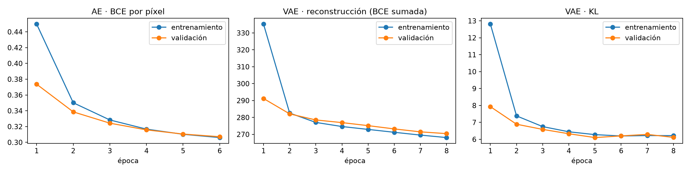
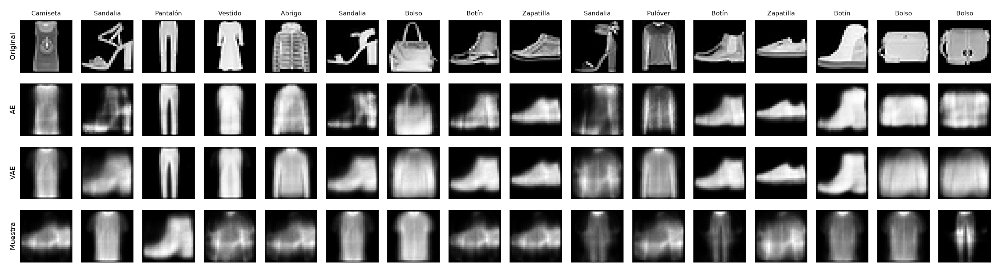
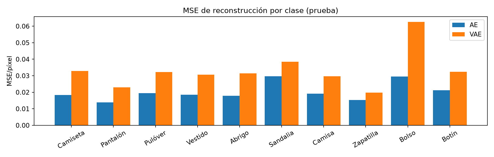
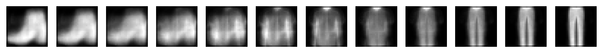
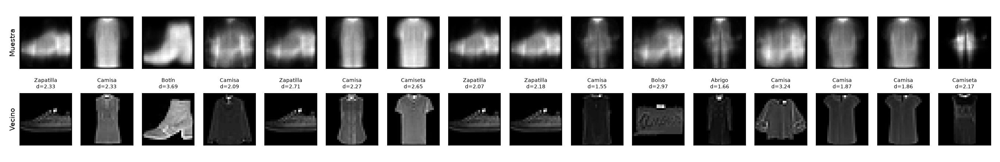
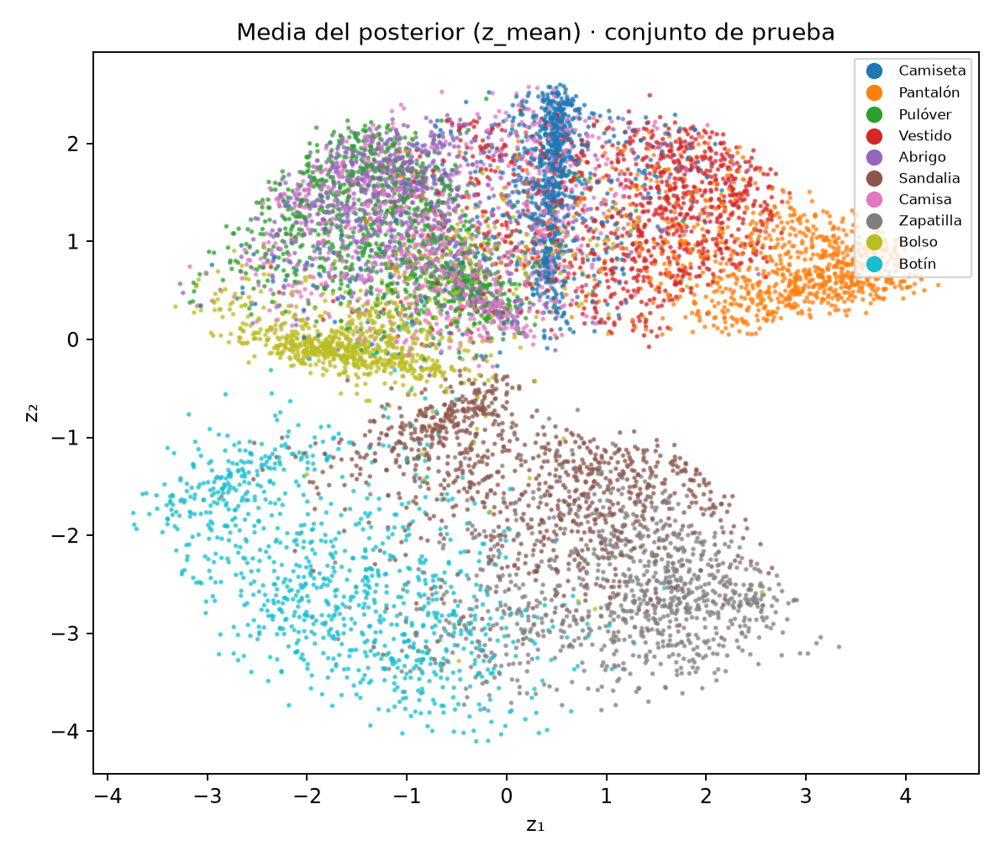

# INF-8239 · Unidad 03 · Modelos generativos

Autor académico: Edwin Ramón José Nolasco

## CPU
```bash
uv python install 3.12
uv sync --extra cpu
uv run python scripts/check_runtime.py
uv run python scripts/train_ae_vae.py --epochs-ae 6 --epochs-vae 8
```

## GPU
Solo para WSL2/Linux con NVIDIA correctamente configurada:
```bash
uv sync --extra gpu
```

## Aplicación
```bash
uv run streamlit run app/streamlit_app.py
```

## Documentación

- [`MODEL_CARD.md`](MODEL_CARD.md): ficha técnica de los modelos (datos, arquitectura, métricas, diversidad, costo y limitaciones).
- [`AI_USE_DECLARATION.md`](AI_USE_DECLARATION.md): declaración del uso de herramientas de IA como apoyo en el trabajo.
- [`notebooks/ae_vae_fashion_mnist.ipynb`](notebooks/ae_vae_fashion_mnist.ipynb): notebook ejecutado con toda la evidencia.

> **Privacidad:** las imágenes generadas por el VAE no se consideran privadas por el solo hecho de ser sintéticas. El análisis de vecinos más cercanos no muestra evidencia de memorización, pero no constituye una garantía de privacidad.

## Resultados principales

Generada por `scripts/train_ae_vae.py` en `reports/results_table.md` (semilla 42, `--epochs-ae 6 --epochs-vae 8`). Las métricas son reproducibles; los tiempos varían ligeramente entre ejecuciones.

| Métrica | AE | VAE |
|---|---|---|
| BCE/píxel · prueba | 0.3068 | 0.3417 |
| MSE/píxel · prueba | 0.0203 | 0.0333 |
| SSIM · prueba (1 = idéntica) | 0.5363 | 0.4206 |
| Mejor val_loss (época) | 0.3071 BCE/píxel (6) | 276.55 BCE sumada + KL (8) |
| KL en validación (mejor época) | — | 6.12 |
| Genera desde N(0, I) | No | Sí |
| Mediana dist. vecino (muestras / prueba real) | — | 2.23 / 3.72 |
| Razón de diversidad (generadas / reales) | — | 0.53 |
| Parámetros | 25,888 | 202,516 |
| Tiempo de entrenamiento CPU (s) | 5.3 | 9.2 |


*Figura 1. Curvas de pérdida con validación. Ningún modelo sobreajusta: en el AE y en el VAE entrenamiento y validación descienden juntos y el mejor punto es la última época. En el VAE la KL se estabiliza en ≈6.2 mientras la reconstrucción sigue bajando.*

Notebook ejecutado con toda la evidencia: `notebooks/ae_vae_fashion_mnist.ipynb`.

## Cierre interpretativo

Evidencia: `reports/ae_vae_panel.png` (16 ejemplos de prueba elegidos con semilla 42), `reports/nearest_neighbors.png`, `reports/interpolation.png` y `reports/training_metrics.json`, obtenidos con `--epochs-ae 6 --epochs-vae 8`, `reports/loss_curves.png`, `reports/per_class_mse.png`, `reports/latent_space.png` y `reports/results_table.md`, todos generados por el script y presentados en el notebook ejecutado `notebooks/ae_vae_fashion_mnist.ipynb`.

**Resultado de reconstrucción:** sobre las 10,000 imágenes de prueba, el AE (latente 16D) obtiene una BCE de 0.3068, un MSE de 0.0203 por píxel y un SSIM de 0.536, y el VAE (latente 2D) una BCE de 0.3417, un MSE de 0.0333 y un SSIM de 0.421. El SSIM, una métrica de similitud estructural más cercana a la percepción visual, confirma la misma conclusión que las métricas por píxel. Ninguno de los dos sobreajusta: ambos se validan con el mismo 10 % del entrenamiento, sus pérdidas de entrenamiento y validación descienden juntas en todas las épocas y el mejor punto es la última (AE: val_loss 0.3071, igual a su BCE de prueba; VAE: val_loss 276.55). Ambos conservan la silueta, pero pierden texturas y detalles. Las sandalias y los bolsos fallan en los dos modelos; el bolso es el mayor error del VAE (el doble que el resto de clases). Las cifras no son directamente comparables porque los latentes y las arquitecturas difieren.


*Figura 2. Panel no seleccionado (16 ejemplos de prueba con semilla 42). Filas: original, reconstrucción AE, reconstrucción VAE y muestra nueva desde N(0, I). El AE conserva más detalle; el VAE produce siluetas genéricas.*


*Figura 3. MSE de reconstrucción por clase sobre las 10,000 imágenes de prueba. El VAE supera al AE en error en todas las clases; el bolso es su mayor fallo.*

**Resultado de generación:** de las 16 muestras tomadas de N(0, I), la mayoría son prendas reconocibles pero borrosas. Dos son híbridos sin forma clara y no se genera ningún bolso, sandalia ni vestido reconocible.


*Figura 4. Interpolación lineal en el latente del VAE de (−2, −1) a (2, 1): transición continua botín → camisa → pantalón, con fotogramas intermedios híbridos poco plausibles.*

**Evidencia de diversidad:** es baja. Las muestras se reducen a unas cuatro formas (zapatilla, prenda superior, pantalón y botín), y 5 de las 16 son prácticamente la misma zapatilla. En 500 muestras, la distancia media entre pares es solo el 53 % de la que hay entre imágenes reales. Los vecinos más cercanos del entrenamiento están a distancias de 1.55 a 3.69 (mediana 2.23), menores que las de imágenes reales de prueba (mediana 3.72). No se interpreta como copia: las muestras son borrosas y la distancia por píxeles favorece ese tipo de imagen (el mismo vecino se repite 4 veces), ninguna está más cerca que la imagen real más cercana y no hay duplicados visibles. No hay evidencia de memorización, pero tampoco garantía de privacidad.


*Figura 5. Cada muestra generada (arriba) junto a su vecino más cercano del entrenamiento (abajo), con su clase y distancia euclidiana. Son variaciones borrosas, no copias; el mismo vecino oscuro se repite varias veces.*

**Comportamiento del espacio latente:** la KL se estabiliza en torno a 6.2, sin colapso. La interpolación es continua (botín → camisa → pantalón), aunque los puntos intermedios son híbridos poco plausibles. El latente separa el calzado de la ropa, pero las prendas superiores (camiseta, camisa, pulóver y abrigo) se solapan en una misma región. La KL de prueba se reparte entre las dos dimensiones (≈3.0 y ≈3.1), así que ambas se usan. Los ejes no tienen un significado garantizado.

<p align="center"></p>

*Figura 6. Media del posterior (z_mean) de las 10,000 imágenes de prueba, coloreada por clase.*

**Costo computacional:** entrenamiento en CPU (Windows nativo, TensorFlow 2.21). El AE tarda ≈4.5–6.2 s y el VAE ≈7.7–12.3 s, según la ejecución. El AE tiene 25,888 parámetros y el decoder 101,520. Los archivos ocupan ≈339 KB (AE) y ≈426 KB (decoder). La inferencia en la aplicación es inmediata.

**Riesgo o limitación:** la arquitectura densa produce imágenes borrosas, la diversidad es limitada y las clases con estructuras finas fallan. Ambos modelos siguen mejorando en la última época (margen con más entrenamiento) y el análisis de vecinos por píxeles es una medida limitada. Una muestra sintética no es privada, original ni libre de sesgo por el solo hecho de ser sintética.

**Decisión sobre uso previsto:** apto para una demostración académica del espacio latente de un VAE. No apto para generar imágenes realistas, para aumentar datos de entrenamiento ni para sustituir datos reales por motivos de privacidad.
